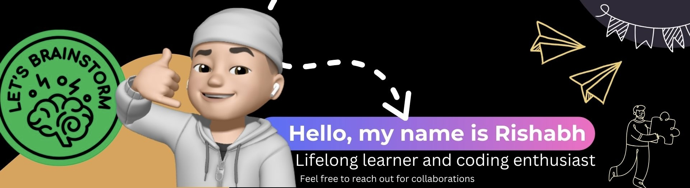

<h1 align="center">Hi 👋, I'm Rishabh Gokhe 
</h1>




[](https://twitter.com/rishabhgokhe)


[](https://portfolio-rishabhgokhe.vercel.app/)

**Currently Working on:** 
- [SkillWave](https://github.com/rishabhgokhe/SkillWave) - Preview App: [https://skillwave20.vercel.app/](https://skillwave20.vercel.app/)
- [TaskFlow](https://github.com/rishabhgokhe/TaskFlow) - Preview App: [https://taskflow20.vercel.app/](https://taskflow20.vercel.app/)

#### **💻 Currently learning :** 


## ◉ More details about me... 

```javascript
const rishabh = {
    pronouns: "He" | "Him",
    code: ["Javascript", "Python", "Swift", "Java", "TypeScript"],
    askMeAbout: ["Web dev", "tech", "iOS dev"],
    technologies: {
        frontend: {
            "React", "Next.js, "JavaScript", "HTML", "CSS", "SASS"
        }
        backEnd: {
            js: ["Node", "Express"],
        },
        mobileApp: {
            "iOS Development"
        },
        devOps: [],
        databases: ["MongoDB", "PostgreSQL"],
    },
    otherInterest = ["UI", "Web Design", "3D Rendering"]
    currentFocus: "Solving one bug at a time",
    funFact: "If debugging is the process of removing bugs, then programming must be the process of putting them in"
};
```
##  Skills and Technologies


## 📫 Connect with Me

[](https://linkedin.com/in/rishabh-gokhe-22168b287)
[](https://github.com/rishabhgokhe)
[](https://twitter.com/rishabhgokhe)
[](https://portfolio-rishabhgokhe.vercel.app/)
[](mailto:rishabhgokhe2004@gmail.com)
[](https://www.instagram.com/rishabh_gokhe)


## 🤝 Let's Collaborate!

I'm always excited to work on innovative projects and collaborate with like-minded individuals. Here are some ways we can collaborate:

- **Freelance Projects:** If you have a project that needs a developer, I'm open to freelance opportunities.
- **Mentorship:** I'm happy to offer mentorship to aspiring developers, especially in areas like web development, tech, and iOS development.
- **Open Source Contributions:** Contributions to my projects or collaborating on new open-source projects are always welcome.
- **Brainstorming Sessions:** If you want to discuss tech ideas or need help with problem-solving, let's schedule a brainstorming session.

Feel free to reach out if you're interested in any of these collaboration opportunities. Let's build something amazing together!

**Thanks for visiting my profile! Don't forget to check out my repositories and leave a star if you find something interesting!**
